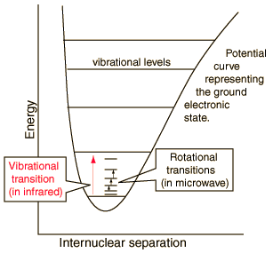

A diatomic molecule has additional degrees of freedom compared to an atom because it has the ability to rotate and vibrate about its center of mass; see below figure for the illustration of forces and hence torque on a molecule placed in an external electromagnetic field.

    

The above figure shows that for every electronic state, several vibrational states are associated with it. Additionally, for every vibrational state, several rotational states are associated with it.

The electromagnetic waves excite the rotational levels of molecules (provided the molecule has a dipole moment), thereby exerting a torque on the molecule. The frequencies of EM radiation absorbed or emitted by a transition between the rotational energy states or the vibrational energy states will lie in microwave ν<1011 Hz, λ>20 μm or infrared regions ν>1013 Hz, λ<20 μm of the EM spectrum. From the rotation part of the IR spectrum, we can calculate the bond length of a diatomic molecule. From the vibration part of the IR spectrum, we can calculate the bond force constant of the diatomic molecule.

The objective of this experiment is to calculate the IR spectra of CO2 and elucidate its vibrational modes.
