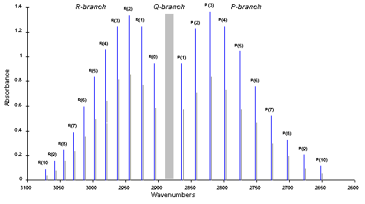
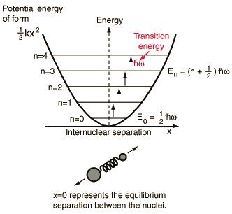

The vibrational transitions of a diatomic molecule in its electronic ground state can be approximated to a Simple Harmonic Oscillator (SHM). The rotational transitions can be approximated to a rigid rotor.

In this lab, please distinguish between ν(spelled 'nu') and v(alphabet 'v'). While the ν is used to denote the frequency, the symbol v denotes the vibrational quantum number.

### Selection

For vibrational transitions: The molecule should have a dipole moment. Δv=±1,±2,.., where v is the vibrational quantum number.

For rotational transitions: ΔJ=±1, where J is the rotational quantum number.

    

### Spectrum identification

- The P-branch corresponds to all transitions where ΔJ=−1
- The R-branch corresponds to all transitions where ΔJ=+1
- The Q-branch corresponds to all transitions where ΔJ=0

### Calculation of Bond force constant

    

The transition frequency (ν) between the vibrational levels is related to the molecular parameters by

ν=2πω

where ω is given by

Ev=(v+12)ℏω, ω=(kmeff)1/2, v=0,1,2,3,⋯

Where meff (reduced mass) is given by

meff=m1m2m1+m2

Ev is permitted energy levels. The value of ω is obtained from the IR spectra. Substituting the value of meff, we get the bond force constant.

### Calculation of Bond length

The rotational energy is given by

EJ=BJ(J+1), J=0,1,2,…

where rotational constant B, is given by

B=ℏ2/2I

where I, the moment of inertia is given by

I=meffR2

where meff is the reduced mass. The separation between the two illustrated vibration-rotation transitions is assumed to be twice the rotational energy change from j=0 to j=1.

2ΔEJ=ℏω

The value of ω is obtained from the IR spectra. We get the moment of inertia from the above equations, and upon substituting meff in the moment of inertia equation, we get the bond length.
